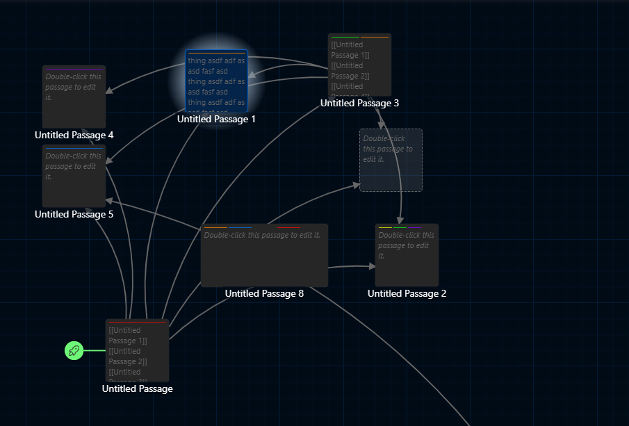
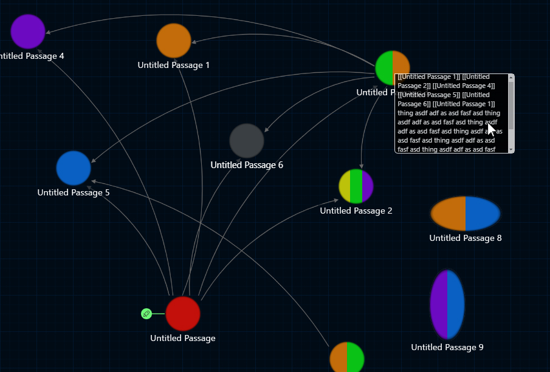

## Twine Desktop 2.7 CSS Customizations:

### Obsidian-like circular nodes (dark mode):
This converts the passage boxes into circular nodes that you can color using the colored tags in an obsidian-like style, adds a small halo to the selected node (picture below), and shows passage content when hovering the node.  The Twine app saves tag order so you can even make different multi-colored nodes using the same colors in a different order.

<table>
  <tr>
    <td style='text-align: center'>Nodes - close up</td>
    <td style='text-align: center'>Nodes - zoomed out</td>
  </tr>
  <tr style='background:transparent !important'>
    <td>
      
    </td>
    <td>
      
    </td>
  </tr>
</table>

