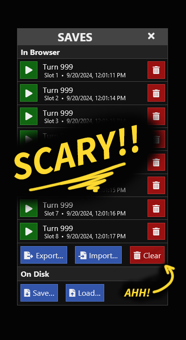
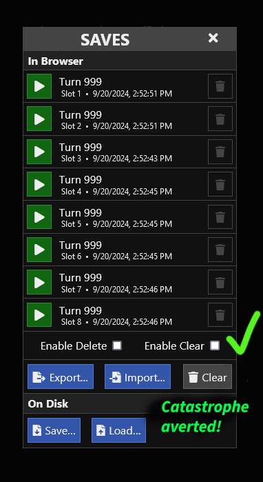

# Save Safety

A failsafe feature which adds two checkboxes to the native SugarCube 2.37 Save API dialog and disables deleting or clearing saves without first ticking those checkboxes.

<table>
    <tr>
        <td style="border-color:transparent"></td>
        <td style="border-color:transparent"></td>
    </tr>
</table>